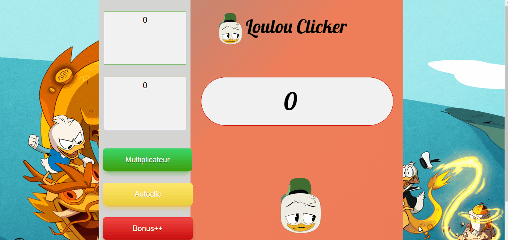

# Loulou Clicker 

This is a ["Cookie Clicker"](http://orteil.dashnet.org/cookieclicker/) type game. The theme was Loulou from Disney. The concept was to click the cookie (i.e. loulou head) and gain as many points as possible. You would receive rewards, become more efficient and build an Empire of cookies (i.e. points)!

This was a group project built by a team of 5 developers. The objective was to create a responsive web app built with HTML, CSS, and JavaScript. 
We used the Agile Methodology to complete the task efficiently and on time.

**Take a look ?** [Demo](https://walter-clayton.github.io/cookieClicker/)

## Features

#### Loulou Head 

  * Adds 1 point every click.
---

#### Multiply 

  * Initially costs 50 points. 
  * The cost doubles each turn.
  * Adds 1 extra point on your click.
  ---

#### Autoclic 

  * Costs 500 points throughout the game.
  * Clicks 1 click per seconds by itself
  * Lasts for 60 seconds.
  ---

#### Bonus 

  * Costs 5000 points throughout the game.
  * Doubles the value of your click.
  * Lasts for 30 seconds.
  ---

#### Bonus Coin 

  * Appears randomly on the page every 30 seconds and lasts for 2 seconds. 
  * Doubles the score on click.
  ---

## Instructions for contributors

if you would like to contribute 

:smiley: [Click here](contribute.md)

## Built with

* HTML5
* CSS3
* Javascript

## Authors

 **Walter Clayton** - [GitHub](https://github.com/walter-clayton) [EN]
 **Peter Van Wymeersch** - [GitHub](https://github.com/peter-vanwymeersch) [FR]
 **Nicolas Tassin** - [GitHub](https://github.com/NicolasTassin) [FR]
 **Moise Nsengiyuma** - [GitHub](https://github.com/Moise-code) [FR]
 **Mouad** - [GitHub](https://github.com/Mouad-becode) [FR]

## Acknowledgment

* Thank you [BeCode](https://www.becode.org) for putting the team together!
* Inspired by [Cookie](http://orteil.dashnet.org/cookieclicker/) 
* Thank you Eric Meyer for the Reset CSS.
